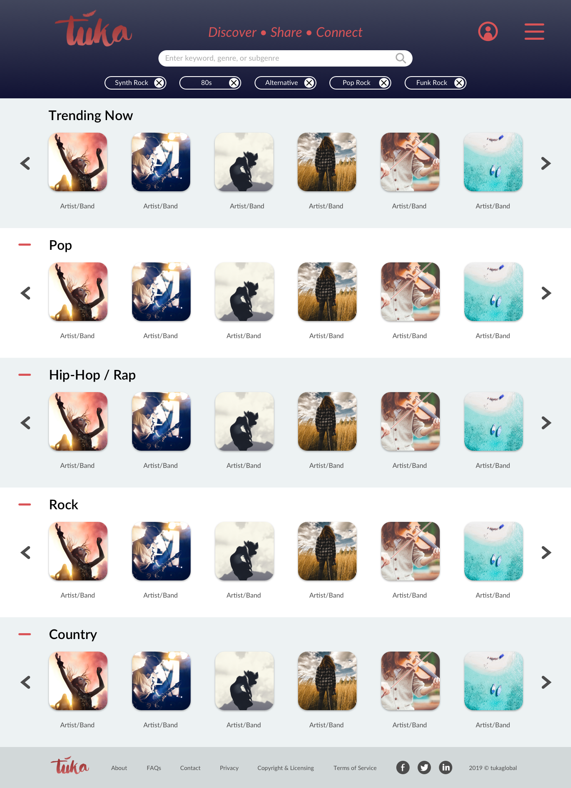

# TUKA
[Tuka](https://www.tukaglobal.com/) is an online  platform that helps creators find audiences, share their content, and get paid, while also helping consumers find the content they love, pay less for it, and rewards them for sharing content across their peer networks.

## Capitol360 Capitol Royale Hackathon
At the [Capitol Royale Hackathon](https://www.capitolroyale.com/developers-apply
), Tuka will use the APIs, especially the UMG API, which includes artist tracks to demonstrate its platform.  Songs from these APIs will be randomly assigned "shares" and "price" info so that they are rated in the app and appear in searches based on their number of shares.

## User Stories
Users are comprised of artists and fans. A curator is any user (artist or fan) who shares a snippet of content with their network and receives tokens if that shared snippet leads to a sale of the content.  
For example, Super-Fan-Ashley LOVES Super-Musician-Jimmy. Jimmy shares a snippet of his hip new jam. Ashley is a follower of Jimmy and listens to the new snippet, she loves it, and purchases the song immediately.  Ashley is then allowed to share a snippet of that song with her own network of friends.  If any of Ashley's network also likes the snippet and goes to Jimmy's page to purchase the full song, Jimmy is paid for his content and Ashley receives tokens for that purchase crediting her for the sale. 
1. Users will be able to create a secure login and a profile page, their profile page will be their landing page upon login.
2. Users will be able to search and filter content snippets by genre, artist, track title keywords (limit to 5 filters) and search results will appear on the page.
3. Artists will be able to upload snippets of their original content.
4. Artists will be able to sell full original content to fans/curators.
5. Fans/curators will be able to purchase content from snippets they like.
6. Fans/curators will be able to share snippets of their purchased content with their network.
    - the number of shares content receives by fans to their networks, the higher the content is ranked (i.e. it is returned first in searches before content with fewer shares)
    - if those shares result in sales, the curator will earn token rewards

## Wireframes
##### The Discovery Portal is the landing page before a user logs into their profile; it displays Trending Now (which is the top most shared (weighted by shares * price) snippets across the platform), as well as the top 5 most popular music genres. The top 5 genres will update to the searched genres once a user begins typing in search terms.

##### When a user hovers over the clip art for a particular snippet, buttons appear that allow the user to play or stop a snippet, or click through to the profile page of the artist that posted the snippet.

##### User Profile page will be the landing page for a logged in user - this page is not being built as part of the Hackathon, but this is to give an idea of the project's next step.

## Technologies
Javascript | HTML5 | CSS/SASS | React.js | MongoDB | Express.js  

The MERN-stack was selected by the product manager for its scalability and use of react's reusable components.

## Team
Michael Harrington - Tuka, Founder
Craig Wilson - Tuka, Product Manager
Brenton Jenkins - Tuka, UX/UI Designer
Erin Johnson - Developer
German Nunez - Developer
Joe Domovitch - Developer
Perice Pope - Developer
